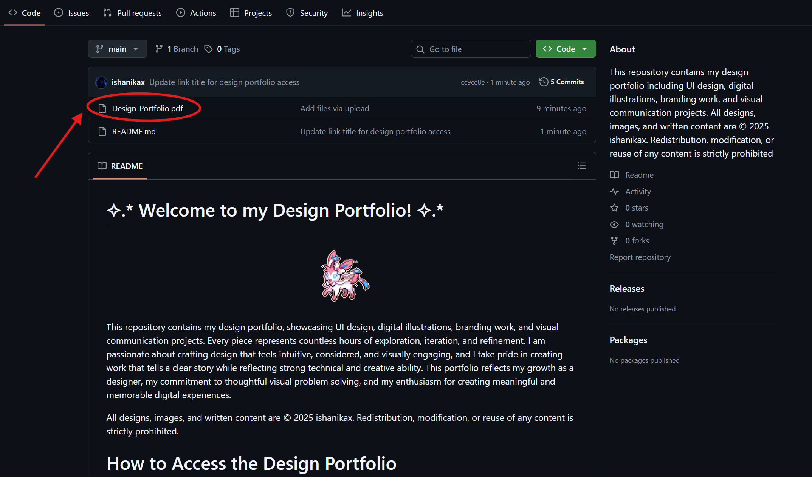
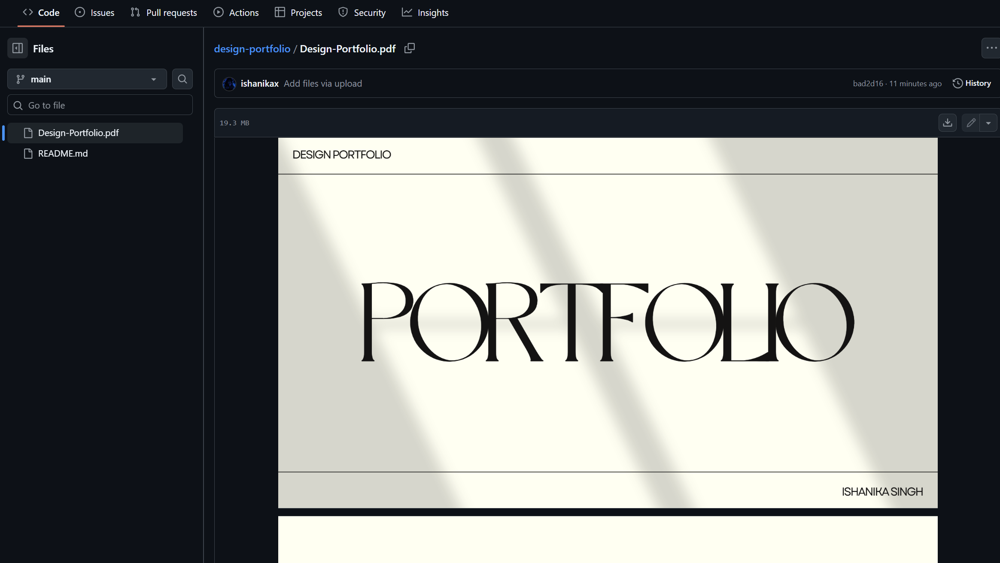

# ✧.* Welcome to my Design Portfolio! ✧.*

  

This repository contains my design portfolio, showcasing UI design, digital illustrations, branding work, and visual communication projects. Every piece represents countless hours of exploration, iteration, and refinement. I am passionate about crafting design that feels intuitive, considered, and visually engaging, and I take pride in creating work that tells a clear story while reflecting strong technical and creative ability. This portfolio reflects my growth as a designer, my commitment to thoughtful visual problem solving, and my enthusiasm for creating meaningful and memorable digital experiences.

All designs, images, and written content are © 2025 ishanikax. Redistribution, modification, or reuse of any content is strictly prohibited.

# How to Access the Design Portfolio
Click on the link at the top titled “Design-Portfolio.pdf” located at the top of the files. This will open the full portfolio for viewing.

